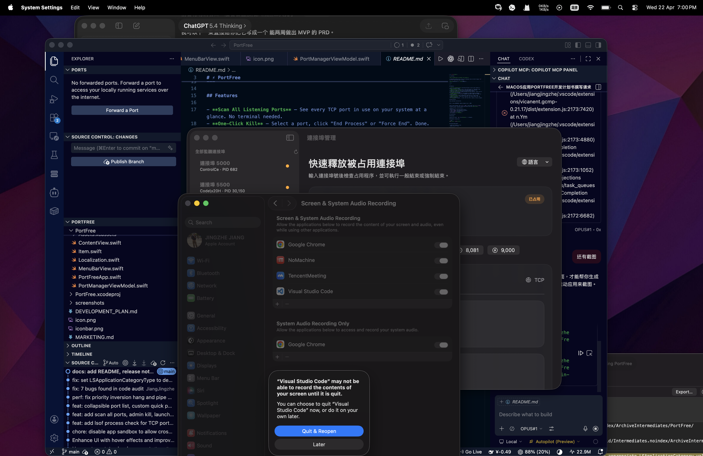

# PortFree 宣发截图指南 / Screenshot Guide

截图保存到 `screenshots/` 文件夹，建议使用 macOS 自带截图工具（`⌘⇧4` 选区 / `⌘⇧4 + 空格` 窗口截图）。

---

## 需要截取的 5 张核心截图

### 1. `main-window.png` — 主窗口完整界面
**操作步骤：**
1. 打开 PortFree 主窗口
2. 在输入框输入 `5173`（或任何你当前在用的端口），点击"检查"
3. 确保左侧边栏显示：全部监听端口列表 + 常用端口 + 最近历史
4. 确保右侧详情面板显示：端口占用信息（进程名、PID、用户、协议、端点、命令等详情卡片）
5. **截图方式：** `⌘⇧4` 然后按空格键，点击 PortFree 窗口

> 💡 这是最重要的一张截图，用于 README 头图和所有宣发的首图。

---

### 2. `menubar-panel.png` — 菜单栏面板
**操作步骤：**
1. 点击菜单栏上的 PortFree 图标，打开菜单栏面板
2. 在面板中输入一个端口（如 `8080`），让它显示检查结果
3. 确保面板可见内容包括：输入框、快捷端口、当前状态、最近记录
4. **截图方式：** `⌘⇧4` 选区截取菜单栏面板

---

### 3. `port-occupied.png` — 端口被占用的详情
**操作步骤：**
1. 在主窗口检查一个确实被占用的端口（如运行中的 Vite `5173`、Node `3000` 等）
2. 确保右侧显示完整的 6 张详情卡片 + "结束进程" / "强制结束" / "复制信息" 按钮
3. **截图方式：** `⌘⇧4` 选区截取右侧详情区域

---

### 4. `scan-all-ports.png` — 全局端口扫描结果
**操作步骤：**
1. 在主窗口确保左侧"全部监听端口"区域已展开（如果折叠了，点击"展开全部"）
2. 确保能看到多个端口和对应进程名
3. **截图方式：** `⌘⇧4` 选区截取左侧侧边栏的端口列表区域

---

### 5. `language-switcher.png` — 多语言切换
**操作步骤：**
1. 点击主窗口右上角的语言切换按钮（地球图标）
2. 展开语言菜单，显示全部 7 种语言选项
3. **截图方式：** `⌘⇧4` 选区截取右上角区域和展开的语言菜单

---

## 截图后的操作

截图保存到 `screenshots/` 后，在 README 中已预留位置。你可以把截图加入到 README 中：

```markdown
## Screenshots



```

### 社交媒体用图建议
- **Twitter/X**：用 `main-window.png` 作为封面图
- **V2EX / 少数派**：按 `main-window` → `menubar-panel` → `port-occupied` 顺序排列
- **GitHub README**：所有 5 张图依次排列
- **Product Hunt**：`main-window.png` 作为 Gallery 第一张

---

## 截图美化（可选）

如果希望截图更专业，可以用以下免费工具添加设备外框：

- **CleanShot X**（macOS 原生，付费）
- **Screenshot Beautiful**（https://screenshots.cool，免费在线）
- **Shottr**（macOS 免费截图工具，支持标注）

建议：
- 使用浅色模式截图（对比度更好）
- 窗口背景选择简洁的桌面壁纸
- 分辨率保持 2x Retina
